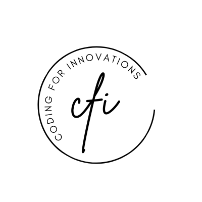
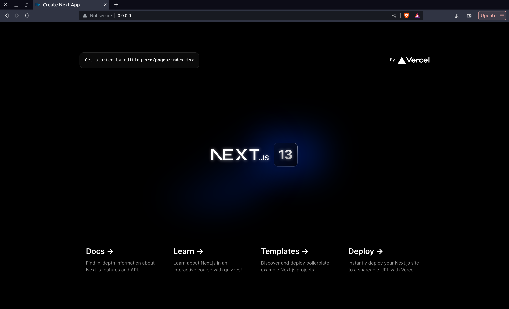
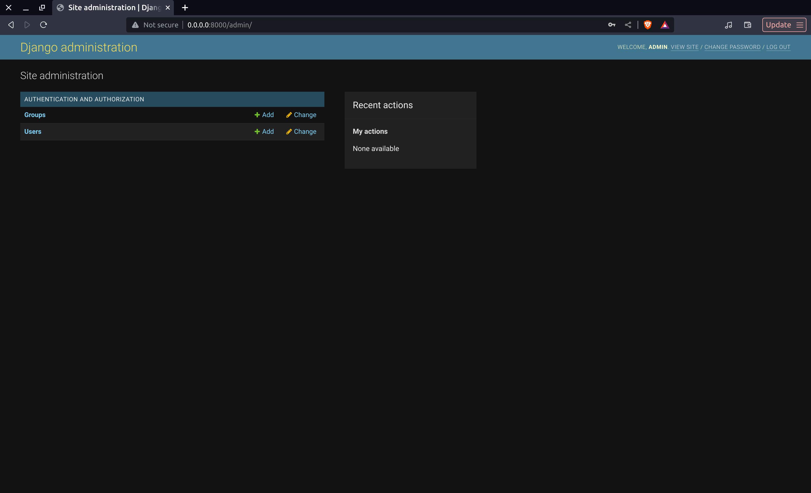

<p align="center">
  <p align="center">
    <a href="https://www.youtube.com/@codingforinnovations" target="_blank">
          
    </a>
  </p>
  <p align="center">
    For Programmers, By Programmers.
  </p>
</p>

# Dockerize Django with Nextjs

A Bootstrapped Template of Django with Nextjs using Docker!

### Youtube Video: [Link](https://www.youtube.com/watch?v=ettHsKT2z9I)

## 📚 Stack

- [Next Js](https://www.nextjs.org/) - The React  Framework  for the Web.
- [Django](https://www.djangoproject.com/) - Django makes it easier to build better web apps more quickly and with less code.
- [Typescript](https://www.typescriptlang.org/) - JavaScript with syntax for types.
- [Docker](https://www.docker.com/)  - Docker is a platform designed to help developers build, share, and run modern applications. We handle the tedious setup, so you can focus on the code.
- [Nginx](https://www.nginx.com/) - Advanced Load Balancer, Web Server, & Reverse Proxy.

  ## 📸 Screenshots:
- Frontend:
 

- Backend:
 


## 📁 Project structure

```
$PROJECT_ROOT
│  
├── apps/web  # Django Backend
│  
├── apps/docker  # Docker files for web, www, nginx
│  
├── apps/www  # Nextjs App
│   
├── apps/web/requirements # Python Requirements
│
├── apps/web/manage.py # Run Django Commands
│
├── apps/www/package.json # npm commands.
```
---

### 🏆 Getting Started:

- Clone Repo

```bash
mkdir dockerize-django-with-nextjs
cd dockerize-django-with-nextjs
git clone https://github.com/codingforinnovations/dockerize-django-with-nextjs .
```
- Using Docker

```docker
docker-compose up --build
```

_Open [Django Server](http://0.0.0.0:8000)  in : [http://0.0.0.0:8000](http://0.0.0.0:8000)_  <br/>

_Open [Django Admin](http://0.0.0.0:8000/admin)  in : [http://0.0.0.0:8000/admin](http://0.0.0.0:8000/admin)_  <br/>

_Open [Nextjs Server](http://0.0.0.0)  in : [http://0.0.0.0](http://0.0.0.0)_  <br/>


## Manual  Way:

#### For Django:
- Create Virtual Environment for Python

```bash
pip install virtualenv
python -m venv .
```

- Activate Virtual Environment

```bash
source Scripts/activate
```
**Window Users use: `.\Scripts\activate`**

- Install Dependencies

```bash
pip install -r apps/web/requirements.txt
```

- Make Migrations

```bash
python manage.py apps/web/makemigrations
python manage.py apps/web/migrate
```

####  For Frontend

- Install Dependencies

```bash
npm install --prefix apps/www
```

- Run Dev Server

```bash
npm run dev
```

- Now for Bundling Your Frontend 

```bash
npm run build
```

## 🎫 LICENSE:

[MIT LICENSE](https://github.com/codingforinnovations/dockerize-django-with-nextjs/blob/main/LICENSE) .

## 🆕 Change Log:

[Change Log](https://github.com/codingforinnovations/dockerize-django-with-nextjs/commits/main) .

<div align="center">
<i>Other places you can find us:</i><br>
<a href="https://www.youtube.com/@codingforinnovations" target="_blank"></a>
</div>
